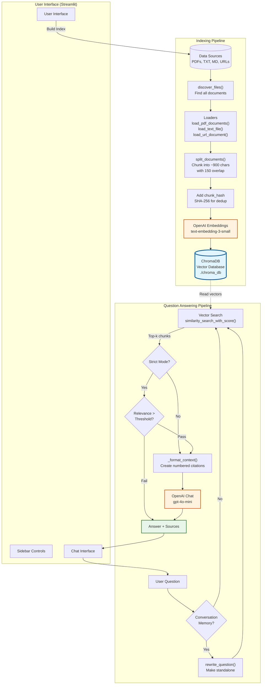
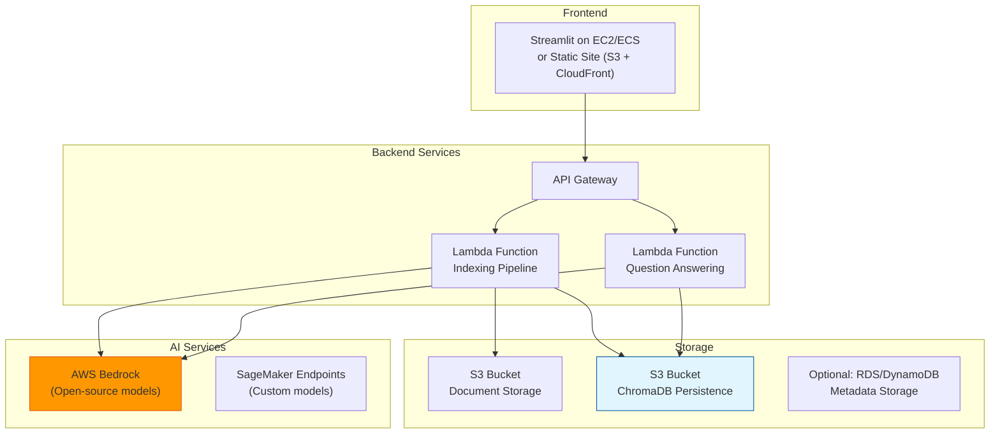

# 🧠 RAG Document Q&A Application

A Retrieval-Augmented Generation (RAG) system built with Streamlit that enables you to ask questions about your local documents (PDFs, text files, markdown) and web URLs using OpenAI's language models.

## ✨ Features

- 📄 **Multi-format document support**: PDF, TXT, and MD files
- 🌐 **Web scraping**: Index content from URLs
- 💬 **Conversational memory**: Follow-up questions with context awareness
- 💰 **Extremely cost-effective**: Index ~750,000 words (2,000-3,000 pages) for less than 2 cents using efficient embedding models
- 🎯 **Strict mode**: Refuses to answer when relevance is too low (prevents hallucinations)
- 📊 **Source citations**: Shows which documents were used with relevance scores
- 💾 **Persistent vector database**: Index survives app restarts with ChromaDB
- 🔄 **Deduplication**: Hash-based chunk deduplication across re-indexing

## Suggestions

You can put all the data about your project in the `data` directory. The data directory is a subdirectory of the project root directory. 

For URLs, you can add them in the sidebar. One URL per line. You can also add them in the `URLLinks.txt` file in the `data` directory. 

**Models** are configurable in the `.env` file. The default models are `gpt-5-nano` for chat and `text-embedding-3-small` for embeddings. We are using `gpt-5-nano` for chat and `text-embedding-3-small` for embeddings and they have been picked for their cost-effectiveness.
For example `gpt-5-nano` is $0.05 for 1M tokens (input) and $0.40 for 1M tokens (output)  and `text-embedding-3-small` is $0.02 for 1M tokens. 

**Vector database** is configurable in the `.env` file. The default vector database is `chromadb`. ChromaDB is the "memory" that lets AI answer questions about your specific documents accurately, even when users ask in different ways. It's the bridge between your content and intelligent, conversational AI responses. In our app: Users drop documents in a folder → ChromaDB indexes them → Users can ask questions in plain English → AI finds relevant info and answers accurately with source citations. 🎯

**Why ChromaDB Specifically?**
- Open source - No vendor lock-in
- Easy to use - Simple Python API
- Runs locally - No need for cloud infrastructure (though it can scale to cloud)
- Built for AI - Designed specifically for RAG (Retrieval-Augmented Generation) applications

**Conversation memory** is configurable in the `.env` file. The default conversation memory is `true`. When enabled, the system rewrites follow-up questions into standalone queries using recent chat history (last 6 messages). For example, if you ask "What is Python?" followed by "What about its history?", the second question is automatically rewritten to "What is the history of Python?" before retrieval, ensuring accurate context-aware results without storing the entire conversation in the vector database.

**Strict mode** is configurable in the `.env` file. The default strict mode is `true`. When enabled, the system refuses to answer if the relevance is too low (prevents hallucinations).

## 🚀 Quick Start

### Prerequisites

- Python 3.10+
- OpenAI API key

### Installation

1. **Clone the repository**
```bash
git clone <your-repo-url>
cd llmrag_experimients
```

2. **Create virtual environment**
```bash
python -m venv .venv
.venv\Scripts\activate  # Windows
# source .venv/bin/activate  # Mac/Linux
```

3. **Install dependencies**
```bash
pip install -r requirements.txt
```

4. **Configure environment variables**

Create a `.env` file in the project root:
```env
OPENAI_API_KEY=your_api_key_here
OPENAI_MODEL=gpt-4o-mini
OPENAI_EMBEDDING_MODEL=text-embedding-3-small
CHROMA_DIR=./chroma_db
CHROMA_COLLECTION=rag_toy
CHUNK_SIZE=900
CHUNK_OVERLAP=150
```

5. **Create data directory**
```bash
mkdir data
```

### Usage

1. **Start the application**
```bash
streamlit run app_streamlit.py
```

2. **Index your documents**
   - Place PDFs, TXT, or MD files in the `./data` directory
   - (Optional) Add URLs in the sidebar
   - Click "Build / Refresh Index"

3. **Ask questions**
   - Type your question in the chat interface
   - View answers with source citations
   - Enable conversation memory for follow-up questions

## 📁 Project Structure

```
llmrag_experimients/
├── app_streamlit.py          # Main Streamlit application
├── rag/
│   ├── __init__.py
│   ├── config.py             # Configuration & settings
│   ├── ingest.py             # Document indexing pipeline
│   ├── loaders.py            # PDF/text/URL loaders
│   └── qa.py                 # Question answering logic
├── data/                     # Your documents (PDFs, TXT, MD)
├── chroma_db/                # Persistent vector database
├── .env                      # Environment variables (not in git)
├── .gitignore
├── requirements.txt
└── README.md
```

## ⚙️ Configuration

### Sidebar Settings

- **Data directory**: Path to your documents (default: `./data`)
- **Reset index**: Clear existing index before rebuilding
- **Optional URLs**: Add web pages to index (one per line)
- **Strict mode**: Refuse answers if relevance < threshold
- **Conversation memory**: Enable follow-up questions with context
- **Min relevance**: Threshold for strict mode (0.0 - 0.9)
- **Retrieved chunks (k)**: Number of document chunks to retrieve (2-12)

### Environment Variables

| Variable | Default | Description |
|----------|---------|-------------|
| `OPENAI_API_KEY` | *(required)* | Your OpenAI API key |
| `OPENAI_MODEL` | `gpt-4o-mini` | Chat model for answers |
| `OPENAI_EMBEDDING_MODEL` | `text-embedding-3-small` | Embedding model |
| `CHROMA_DIR` | `./chroma_db` | Vector database directory |
| `CHROMA_COLLECTION` | `rag_toy` | Collection name |
| `CHUNK_SIZE` | `900` | Document chunk size (characters) |
| `CHUNK_OVERLAP` | `150` | Overlap between chunks |

## 🛠️ Technologies

- **[Streamlit](https://streamlit.io/)**: Web UI framework
- **[LangChain](https://python.langchain.com/)**: RAG framework
- **[ChromaDB](https://www.trychroma.com/)**: Vector database
- **[OpenAI](https://openai.com/)**: Embeddings & chat models
- **[PyPDF](https://pypdf.readthedocs.io/)**: PDF parsing
- **[Trafilatura](https://trafilatura.readthedocs.io/)**: Web scraping

## 📝 How It Works

### Architecture Diagram



### Indexing Pipeline

1. **Discovery**: Recursively finds PDFs, TXT, and MD files in `data/`
2. **Loading**: Extracts text from documents and web pages
3. **Chunking**: Splits documents into 900-character chunks with 150-char overlap
4. **Embedding**: Converts chunks to vector embeddings via OpenAI
5. **Storage**: Stores in ChromaDB with hash-based deduplication

### Question Answering

1. **Optional rewrite**: Converts follow-up questions to standalone questions using chat history
2. **Retrieval**: Searches vector database for top-k similar chunks
3. **Relevance check**: If strict mode enabled, refuses if best match < threshold
4. **Generation**: LLM generates answer using retrieved context
5. **Citations**: Returns answer with source references

## � Future Improvements

### 1. AWS Cloud Deployment

**Current State**: Runs locally with local ChromaDB storage

**Proposed Architecture**:



**Implementation Steps**:
- **Streamlit UI**: Deploy on EC2, ECS (Fargate), or convert to React/Next.js hosted on S3 + CloudFront
- **API Gateway**: REST or HTTP API to handle requests
- **Lambda Functions**: 
  - `indexing-lambda`: Triggered by S3 uploads, processes documents and updates ChromaDB
  - `qa-lambda`: Handles user questions, retrieves from ChromaDB, returns answers
- **S3 Storage**: 
  - Bucket for raw documents (PDFs, TXT, MD)
  - Bucket for ChromaDB persistence files
- **IAM Roles**: Configure proper permissions for Lambda → S3, Lambda → Bedrock

---

### 2. Open-Source Models (Eliminate OpenAI Dependency)

**Current**: Uses OpenAI API (`text-embedding-3-small`, `gpt-4o-mini`)

**Open-Source Alternatives**:

| Component | Current | Open-Source Alternative | Hosting Option |
|-----------|---------|------------------------|----------------|
| **Embeddings** | `text-embedding-3-small` | `all-MiniLM-L6-v2` (sentence-transformers)<br/>`bge-small-en-v1.5`<br/>`e5-base-v2` | AWS Bedrock (Titan Embeddings)<br/>SageMaker endpoint<br/>Local inference |
| **Chat Model** | `gpt-4o-mini` | `Llama 3.1 8B`<br/>`Mistral 7B`<br/>`Phi-3.5 Mini` | AWS Bedrock<br/>SageMaker endpoint<br/>EC2 with vLLM |

**AWS Bedrock Benefits**:
- No infrastructure management
- Pay-per-use pricing
- Access to models like:
  - **Titan Embeddings** (replaces OpenAI embeddings)
  - **Llama 3.1**, **Mistral**, **Claude** (chat models)
- Code change minimal (swap `langchain_openai` → `langchain_aws`)

**Example Code Change**:
```python
# Current: OpenAI
from langchain_openai import OpenAIEmbeddings, ChatOpenAI

# Future: AWS Bedrock
from langchain_aws import BedrockEmbeddings
from langchain_aws import ChatBedrock

embeddings = BedrockEmbeddings(model_id="amazon.titan-embed-text-v1")
llm = ChatBedrock(model_id="anthropic.claude-3-haiku-20240307-v1:0")
```

---

### 3. ChromaDB Persistence in S3

**Current**: ChromaDB stored locally in `./chroma_db`

**Proposed**: Sync ChromaDB to S3 for durability and multi-Lambda access

**Implementation Options**:

**Option A: Direct S3 Sync (Simple)**
```python
import boto3
import os

# After indexing, sync to S3
os.system(f"aws s3 sync {settings.persist_dir} s3://my-bucket/chroma_db/")

# Before querying, sync from S3
os.system(f"aws s3 sync s3://my-bucket/chroma_db/ {settings.persist_dir}")
```

**Option B: EFS (Elastic File System)**
- Mount EFS to Lambda functions
- ChromaDB reads/writes directly to EFS
- Shared across multiple Lambda invocations
- Better for high-concurrency

**Option C: Managed Vector DB**
- Switch from ChromaDB to:
  - **Pinecone** (managed, serverless)
  - **Weaviate Cloud**
  - **AWS OpenSearch with vector search**
  - **pgvector on RDS**

---

### 4. UI and Lambda Architecture

**Challenge**: Streamlit is not serverless-friendly (stateful, long-running)

**Solution: Decouple UI from Backend**

**Architecture Pattern**:

```
Frontend (UI)          Backend (API + Lambdas)
┌─────────────────┐    ┌──────────────────────┐
│                 │    │                      │
│  React/Next.js  │───▶│  API Gateway         │
│  (S3 + CF)      │    │                      │
│                 │    │  ┌────────────────┐  │
│  - Upload docs  │    │  │ indexing-lambda│  │
│  - Ask questions│    │  └────────────────┘  │
│  - View sources │    │                      │
│                 │    │  ┌────────────────┐  │
│                 │    │  │ qa-lambda      │  │
│                 │    │  └────────────────┘  │
└─────────────────┘    └──────────────────────┘
```

**UI Options**:

1. **Keep Streamlit** (Easier migration):
   - Deploy on **ECS Fargate** or **EC2**
   - Use **Application Load Balancer**
   - Call Lambda functions via API Gateway
   - Session state in **ElastiCache (Redis)**

2. **Migrate to React/Next.js** (Fully serverless):
   - Static site on **S3 + CloudFront**
   - API calls to **API Gateway → Lambda**
   - No server costs when idle
   - Better scalability

**Lambda Function Breakdown**:

**Indexing Lambda**:
- **Trigger**: S3 `PUT` event (new document uploaded)
- **Process**: 
  1. Download document from S3
  2. Extract text (PyPDF, Trafilatura)
  3. Chunk and embed
  4. Update ChromaDB
  5. Sync ChromaDB to S3
- **Timeout**: 5-15 minutes (configurable)
- **Memory**: 1-3 GB (for large PDFs)

**QA Lambda**:
- **Trigger**: API Gateway HTTP POST
- **Process**:
  1. Sync ChromaDB from S3 (or use EFS)
  2. Rewrite question (if conversation memory)
  3. Vector search
  4. Call LLM (Bedrock/SageMaker)
  5. Return answer + sources
- **Timeout**: 30 seconds
- **Memory**: 512 MB - 1 GB

**Cost Optimization**:
- Use **Lambda SnapStart** for faster cold starts
- Cache embeddings in **ElastiCache**
- Use **Reserved Concurrency** for QA function (avoid cold starts)

---

### 5. Implementation Roadmap

**Phase 1: AWS Basic Deployment** ✅ Quick Win
- Deploy Streamlit on EC2
- Store documents in S3
- Keep OpenAI API (minimal code changes)

**Phase 2: Serverless Backend** 🔄 Moderate Effort
- Create Lambda for indexing
- Create Lambda for QA
- API Gateway integration
- S3 sync for ChromaDB

**Phase 3: Open-Source Models** 🔄 Moderate Effort
- Migrate to AWS Bedrock
- Test embedding quality (compare retrieval accuracy)
- Test LLM quality (compare answer quality)

**Phase 4: Full Serverless** 🚀 Advanced
- Migrate UI to React + S3
- Use EFS or managed vector DB
- ElastiCache for sessions
- CloudWatch for monitoring

---

### 6. Estimated AWS Costs (Monthly)

**Scenario: 1,000 users, 10,000 questions/month, 100 GB documents**

| Component | Service | Estimated Cost |
|-----------|---------|----------------|
| **Storage** | S3 (100 GB docs + ChromaDB) | $2.30 |
| **Embeddings** | Bedrock Titan (10M tokens) | $0.10 |
| **Chat** | Bedrock Llama 3.1 8B (10M tokens) | $2.00 |
| **Compute** | Lambda (10K invocations) | $0.20 |
| **API** | API Gateway (10K requests) | $0.04 |
| **UI** | EC2 t3.small (if using Streamlit) | $15.00 |
| **Total** | | **~$20/month** |

**Note**: Fully serverless (React UI on S3) would reduce to **~$5/month**!

## �🔒 Security

- `.env` file is **gitignored** (never commit API keys!)
- Virtual environment excluded from version control
- User data in `data/` directory not tracked

## 📄 License

This project is open source and available under the MIT License.

## 🤝 Contributing

Contributions are welcome! Feel free to open issues or submit pull requests.

---

**Happy querying!** 🎉
